---

layout: yandex2

style: |
    /* собственные стили можно писать здесь!! */

    #question pre {
        margin: 0;
    }

    #async-errors pre {
        margin: 0;
    }

    #deb-and-thr img {
        width: 90%;
    }

    .title h3 img {
        display: none;
    }

    .title h2,
    .title .authors {
        left: -100px;
    }

    .title {
        background-image: url(/shri-async/pictures/bg.png);
        background-size: contain;
    }
---

# {:.logo}

## {{ site.presentation.title }}
{:.title}

### {{ site.presentation.service }}



{:.nda}


<div class="authors">


<p>{{ site.author.name }}, {{ site.author.position }}</p>



<p>{{ site.author2.name }}, {{ site.author2.position }}</p>


</div>

<!-- Начало презентации -->


## В каком порядке покажутся сообщения?

```js
Promise.resolve().then(() => {
    console.log('promise')
})

setTimeout(() => {
    console.log('setTimeout')
}, 0)

queueMicrotask(() => {
    console.log('queueMicrotask')
})

console.log('script end')
```
{:.next#question style="float:left;"}

- ...script end
- ...promise
- ...queueMicrotask
- ...setTimeout
{:.image-right style="margin-top: -30px"}


## <b>Event Loop</b >
{:.section#event-loop}

### Цикл событий


## Несколько дел независимо
{:.fullscreen}

<figure markdown="1">
Несколько дел независимо
</figure>
{:style="width: 800px;"}


## Две важные задачи
{:.images}

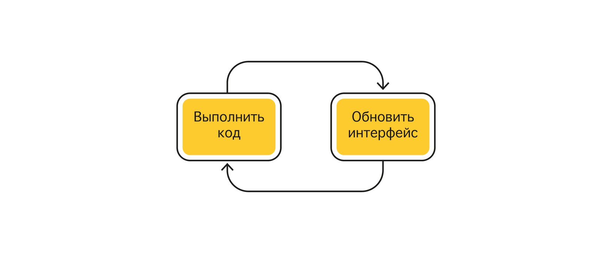


## Стек вызовов
{:.images}

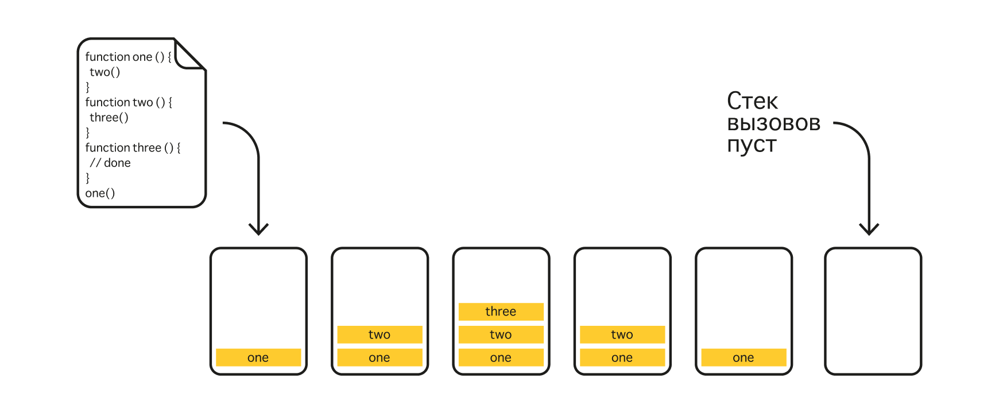


## Этапы обновления интерфейса
{:.images}

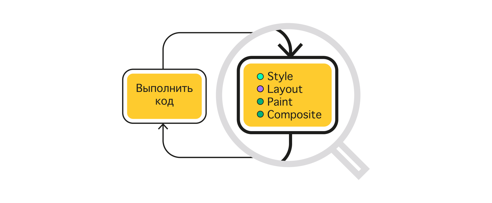

### ...[Оптимизация производительности фронтенда. Часть 2](https://habr.com/ru/post/517594/)


## Первый виток цикла событий
{:.fullscreen}

<figure markdown="1">
Первый виток цикла событий
</figure>
{:style="width: 850px;"}


## Цикл событий about:blank
{:.images}

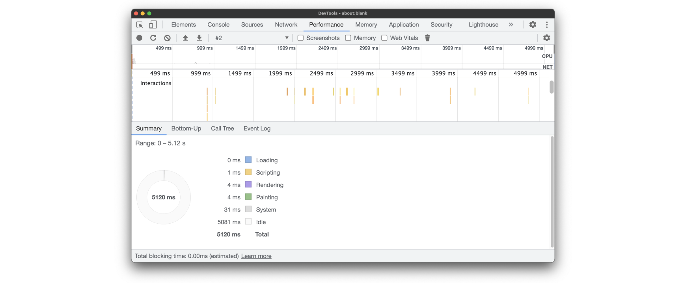


## Задачи, тики и Web API

- ...<b>Задача</b> — это JavaScript-код, который выполняется в стеке вызовов
- ...<b>Тик</b> — выполнение задачи в стеке вызовов
- ...<b>Web API</b> — свойства и методы в глобальном объекте Window


## Синхронные и асинхронные методы

```js
// синхронные методы
const button = document.createElement('button')
document.body.appendChild(button)
button.textContent = 'OK'
```
{:.next}

```js
// асинхронный метод
fetch('/url')
    .then((response) => {
        // выполнится когда-то в будущем
    })
```
{:.next}


## Очередь задач
{:.images}

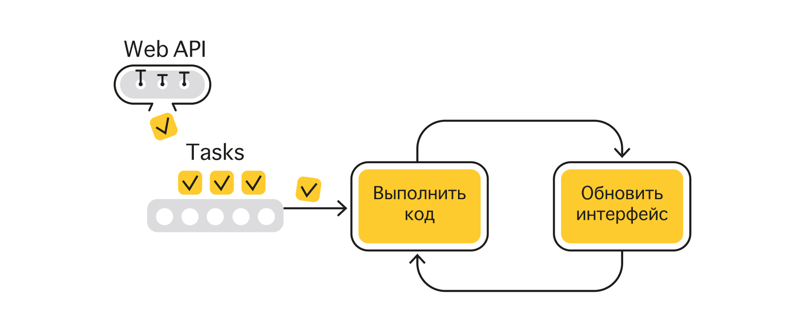


## Взаимодействие с очередью задач

```js
setTimeout(() => {
    // поставить задачу в очередь через 1000 мс
}, 1000)
```
{:.next}

```js
document.body.addEventListener('click', () => {
    // поставить задачу в очередь, когда наступит событие
})
```
{:.next}


## Время на выполнение задачи
{:.fullscreen}

<figure markdown="1">
Время на выполнение задачи
</figure>
{:style="width: 850px;"}


## Обработка больших задач

```js
function longTask () {
    toDoSomethingFirst()

    setTimeout(() => {
        toDoSomethingLater()
    }, 0)
}
```
{:.next}


## postMessage

```js
window.addEventListener('message', (e) => {
    console.log(e.data)
})

window.postMessage('......')
```
{:.next}


## Event Loop — это один поток
{:.fullscreen}

<figure markdown="1">
Event Loop — это один поток
</figure>
{:style="width: 800px;"}


## Web Worker API

```js
const worker = new Worker('worker.js')

worker.addEventListener('message', () => {
    // получить данные
})

// отправить данные
worker.postMessage('......')
```
{:.next}


## Очередь микрозадач
{:.images}

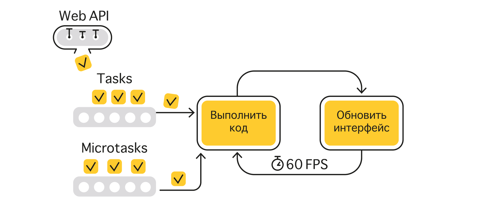


## Взаимодействие с очередью микрозадач

```js
Promise.resolve.then(() => {
    // микрозадача
})
async function () {
    await // микрозадача
}
queueMicrotask(() => {
    // микрозадача
})
new MutationObserver(() => {
    // микрозадача
}).observe(document.body, { childList: true, subtree: true })
```
{:.next}


## [JS Visualizer 9000](https://www.jsv9000.app/)
{:.blockquote}


## requestAnimationFrame
{:.images}


## Очередь requestAnimationFrame
{:.images}

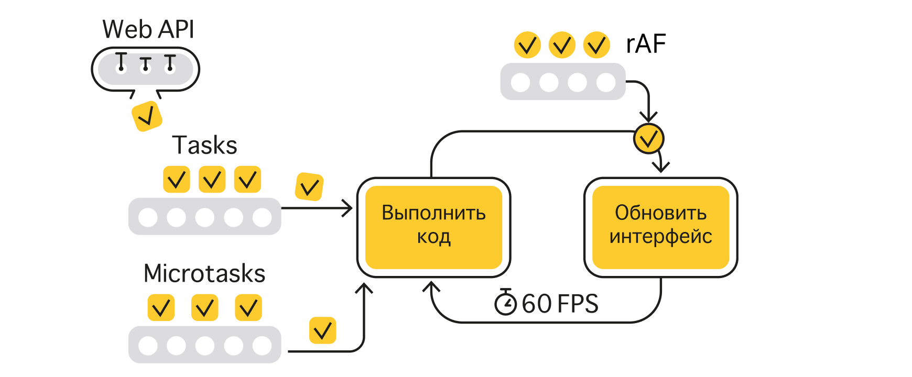


## Вызов requestAnimationFrame

```js
requestAnimationFrame(() => {
    console.log('one')
})

requestAnimationFrame(() => {
    console.log('two')
})

requestAnimationFrame(() => {
    console.log('three')
})

// one two three
```
{:.next}


## Повторяющаяся задача

```js
let requestId

function animate () {
    requestId = requestAnimationFrame(animate)
}

requestId = requestAnimationFrame(animate)

setTimeout(() => {
    // отменить анимации через какое-то время
    cancelAnimationFrame(requestId)
}, 3000)
```
{:.next}


## requestIdleCallback

```js
function sendAnalytics () {
    // отправить данные для аналитики
}

requestIdleCallback(sendAnalytics, { timeout: 2000 })
```
{:.next}


## Очередь requestIdleCallback
{:.images}

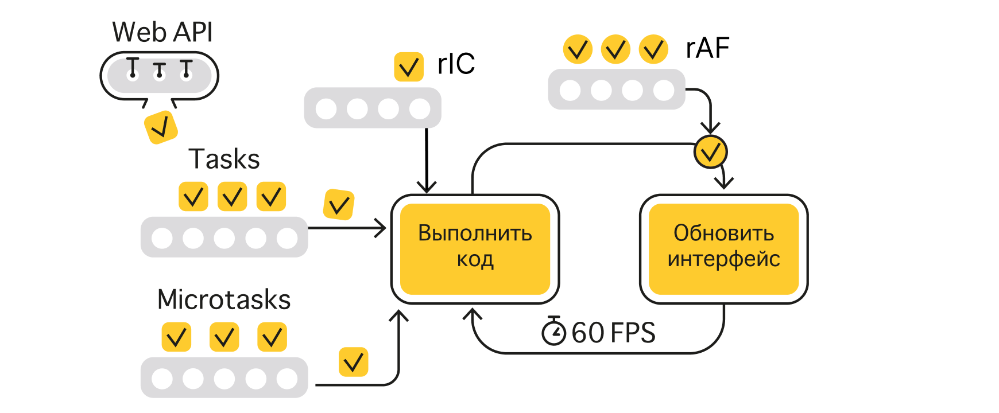


## Сравнение очередей

- ...<b>Микрозадачи</b> — самая приоритетная, выполняем, пока есть задачи
- ...<b>Задачи</b> — одно или несколько заданий между обновлениями интерфейса
- ...<b>rAF</b> — все задачи из очереди, но новые — уже в следующем тике
- ...<b>rIC</b> — в период простоя, когда нет более приоритетных задач

## Взаимодействие с очередями

- ...<b>Задачи</b> — таймеры, события (включая обработку postMessage)
- ...<b>Микрозадачи</b> — промисы, async ф-ции, Observer API, queueMicrotask
- ...<b>rAF / rIC</b> — соответствующие вызовы API

## Цикл событий в Node.js
- ...Работает схожим образом, но набор очередей отличается
- ...[Difference between process.nextTick and queueMicrotask](https://stackoverflow.com/questions/55467033/difference-between-process-nexttick-and-queuemicrotask/57325561#57325561)
- ...[NodeJS Event Loop by Deepal Jayasekara](https://blog.insiderattack.net/event-loop-and-the-big-picture-nodejs-event-loop-part-1-1cb67a182810)


## Добро пожаловать в Callback Hell
{:.fullscreen}

<figure markdown="1">
Добро пожаловать в Callback Hell
</figure>
{:style="width: 950px;"}


## Продолжение следует...
{:.section}

### Конец эпизода про Event Loop


## <b>Callback</b>
{:.section#callback}

### Функция обратного вызова


## Callback Hell и Pyramid of Doom

```js
fetchUser(url, (user) => {
    fetchRole(user, (role) => {
        fetchToken(role, (token) => {
            fetchAccess(token, (access) => {
                fetchReport(access, (report) => {
                    fetchContent(report, (content) => {
                        // вот теперь-то поработаем с данными
                    })
                })
            })
        })
    })
})
```
{:.next}


## Не выпускайте Залго

```js
syncOrAsync(() => {
    // как именно выполняется код?
})
```
{:.next}

```js
// синхронная реализация
function syncOrAsync (callback) {
    callback()
}
// асинхронная реализация
function syncOrAsync (callback) {
    queueMicrotask(callback)
}
```
{:.next}

### ...[Designing APIs for Asynchrony](https://blog.izs.me/2013/08/designing-apis-for-asynchrony)


## Жесткая сцепленность

```js
step1((error, data) => {
    if (error) {
        // отменить этап №1
    }
```
{:.next}

```js
    step2((error, data) => {
        if (error) {
            // отменить этап №2, а затем №1
        }
    })
}))
```
{:.next}

## Инверсия управления

```js
import { thirdPartyCode } from 'third-party-package'

thirdPartyCode(() => {
    // инверсия управления
})
```
{:.next}


## Впереди появилась надежда
{:.fullscreen}

<figure markdown="1">
Впереди появилась надежда
</figure>
{:style="width: 850px;"}


## Продолжение следует...
{:.section}

### Конец эпизода про Callback

## <b>Promise</b>
{:.section#promise}

### Промисы


## Промис — это талон
{:.fullscreen}

<figure markdown="1">
Промис — это талон
</figure>
{:style="width: 700px;"}


## Выполнение или отказ

```js
// выставить промис на выполнение
const resolvedPromise = new Promise((resolve, reject) => {
    setTimeout(() => { resolve('👌') }, 1000)
})
```
{:.next}

```js
// выставить промис на отказ
const rejectedPromise = new Promise((resolve, reject) => {
    setTimeout(() => { reject('💥') }, 1000)
})
```
{:.next}


## Обработка выполнения

```js
resolvedPromise.then((value) => {
    console.log(value) // 👌
})
```
{:.next}


## Обработка отказа

```js
rejectedPromise.then(
    (value) => {
        // ... проигнорировано
    },
    (error) => {
        console.log(error) // 💥
    }
)
```
{:.next}

```js
rejectedPromise.catch((error) => {
    console.log(error) // 💥
})
```
{:.next}


## Значение выставляется раз и навсегда

```js
const promise = new Promise((resolve, reject) => {
    resolve('👌')
    reject('💥') // уже никак не повлияет на состояние Promise
})

promise.then((value) => {
    console.log(value) // 👌
})

promise.then((value) => {
    console.log(value) // 👌
})
```
{:.next}


## Статические методы resolve и reject

...Возвращают <b>установленный</b> промис

```js
Promise.resolve('👌').then((value) => {
    console.log(value) // 👌
})

Promise.reject('💥').catch((error) => {
    console.log(error) // 💥
})
```
{:.next}


## Метод finally

- ...Выполнит какую-то работу, <b>независимо</b> от <b>успеха</b> или <b>неудачи</b>
- ...<b>Ничего не получает</b>, но <b>пробрасывает</b> результат через себя

```js
Promise.resolve('👌').finally(() => {
    // какая-то работа
}).then((value) => {
    console.log(value) // 👌
})
```
{:.next style="float:left;"}

```js
Promise.reject('💥').finally(() => {
    // какая-то работа
}).catch((error) => {
    console.log(error) // 💥
})
```
{:.next.image-right}


## Хитрости Promise

- ...Цепочки из Promise
- ...Обработка ошибок
- ...Thenable объекты


## Цепочки из Promise
{:.section}


## Последовательные операции

...Обработчики неявно <b>возвращают новый промис</b>

```js
Promise.resolve()
    .then(() => {
        // return new Promise((resolve) => resolve())
    })
    .then(() => {
        // мы ничего не вернули из then, но код продолжает работать
    })
```
{:.next}


## Возвращение значения через return

Любое значение, <b>кроме промиса</b> будет <b>завернуто в промис</b>

```js
Promise.resolve()
    .then(() => {
        return 'Заверните меня, пожалуйста!'
    })
    .then((value) => {
        // у String нет метода then, но код продолжает работать
        console.log(value) // "Заверните меня, пожалуйста!"
    })
```
{:.next}


## Возвращение Promise через return

Промис <b>распакуется</b>, а затем значение <b>запакуется в новый промис</b>

```js
Promise.resolve()
    .then(() => {
        return Promise.resolve('🔥')
    })
    .then((value) => {
        console.log(value) // 🔥
    })
```
{:.next}


## Каждый then цепляется к предыдущему

...Пример ниже можно улучшить 👇

```js
promise
    .then((url) => {
        return fetchHost(url).then((address) => {
            return fetchConnection(address).then((connection) => {
                return fetchData(connection)
            })
        })
    })
    .then((data) => {
        // данные успешно загружены! 🎉
    })
```
{:.next}

## Порядок исполнения — линейный

```js
promise
    .then((url) => {
        return fetchHost(url)
    })
    .then((address) => {
        return fetchConnection(address)
    })
    .then((connection) => {
        return fetchData(connection)
    })
    .then((data) => {
        // данные успешно загружены! 🎉
    })
```

## Обработка ошибок
{:.section}

## Проброс отказа

```js
Promise.resolve()
    .then(() => {
        return Promise.reject('💥')
    })
    .then(() => {
        // все обработчики на выполнение будут пропущены
    })
    .catch((error) => {
        console.log(error) // 💥
    })
    .then(() => {
        // продолжаем выполнять цепочку в штатном режиме
    })
```
{:.next}


## Обработчик отказа поймает любые ошибки

```js
Promise.resolve()
    .then(() => {
        undefined.toString()
    })
    .catch((e) => {
        console.log(e) // TypeError: Cannot read property 'toString' of undefined
    })
```
{:.next}


## Спрятанный try/catch

```js
Promise.resolve()
    .then(() => {
        try {
            undefined.toString()
        } catch (e) {
            return Promise.reject(e)
        }
    })
    .catch((e) => {
        console.log(e) // TypeError: Cannot read property 'toString' of undefined
    })
```


## В catch тоже работает return

```js
Promise.reject('💥')
    .catch((error) => {
        console.log(error) // 💥
        return '👌'
    })
    .then((value) => {
        console.log(value) // 👌
    })
```
{:.next}


## Поставь catch в конце!
{:.blockquote}


## Кто поймает ошибку в последнем catch?

...Сборщик мусора! 🗑️

```js
window.addEventListener('unhandledrejection', (event) => {
    console.log('Необработанная ошибка Promise. Позор вам!')
    console.log(event) // PromiseRejectionEvent
    console.log(event.reason) // 💥
})

Promise.reject('💥') // Unhandled Promise Rejection
```
{:.next}

### ...[В некоторых библиотеках есть метод .done](http://bluebirdjs.com/docs/api/done.html#done)


## Разрыв цепочки

```js
Promise.resolve()
    .then(() => {
        Promise.reject('💥')
    })
    .catch(() => {
        // будет пропущено, потому что не указан return
        // будет выброшено UnhandledPromiseRejection
    })
```
{:.next}


## Thenable объекты
{:.section}


## Thenable объект

...Объект, у которого <b>есть метод then</b>

```js
const thenable = {
    then (fulfill) {
        return fulfill('🐵')
    }
}
```
{:.next}

...Скорее всего, это <b>полифилл для Promise</b> до ES6


## Всемогущая совместимость

- ...<b>Promise.resolve</b>, <b>resolve</b> и <b>return</b> распакуют значение <b>thenable объекта</b>
- ...Обернут распакованное значение в полноценный <b>ES6 Promise</b>

```js
const awesomeES6Promise = Promise.resolve(thenable)
```
{:.next}

```js
awesomeES6Promise.then((value) => {
    console.log(value) // 🐵
})
```
{:.next}


## Ещё несколько тонкостей
{:.section}


## Как Promise.resolve обработает Promise?

...<b>Promise.resolve</b> вернет его <b>без изменений</b>

```js
const promise = Promise.resolve('🍏')
```
{:.next}

```js
const resolved = Promise.resolve(promise)
```
{:.next}

```js
console.log(promise === resolved) // true
```
{:.next}

```js
resolved.then((value) => {
    console.log(value) // 🍏
})
```
{:.next}


## Но resolve и return создают новый Promise

```js
const promise = Promise.resolve('🍏')
```
{:.next}

```js
promise === Promise.resolve(promise) // true
```
{:.next}

```js
promise === new Promise((resolve) => resolve(promise)) // false
```
{:.next}

```js
promise === Promise.resolve().then(() => promise) // false
```
{:.next}


## Как Promise.reject обработает Promise?

...<b>Promise.reject</b> еще раз <b>обернет в Promise</b> как причину отказа

```js
const promise = Promise.resolve('🍏')
```
{:.next}

```js
const rejected = Promise.reject(promise)
```
{:.next}

```js
console.log(promise === rejected) // false
```
{:.next}

```js
rejected.catch((value) => {
    console.log(value) // Promise {<resolved>: 🍏}
})
```
{:.next}

## resolve и reject схожим образом

```js
const promise = Promise.resolve('🍏')
```
{:.next}

```js
new Promise((resolve) => resolve(promise)).then((value) => {
    console.log(value) // 🍏
})
```
{:.next}

```js
new Promise((_, reject) => reject(promise)).catch((value) => {
    console.log(value) // Promise {<resolved>: 🍏}
})
```
{:.next}


## all, race, allSelected, any
{:.section#static-methods}

### Статические методы Promise

## Вспомогательная функция

```js
const setPromise = (value, ms, isRejected = false) =>
    new Promise((resolve, reject) =>
        setTimeout(() => isRejected ? reject(value) : resolve(value), ms))
```
{:.next}

## Promise.all

...Возвращает <b>массив значений</b> или <b>первый отказ</b>

```js
Promise.all([
    setPromise('👌', 400),
    setPromise('👌', 200),
]).then((result) => {
     // [ 👌, 👌 ]
    console.log(result)
})
```
{:.next style="float:left;"}

```js
Promise.all([
    setPromise('👌', 400),
    setPromise('💥', 200, true),
]).catch((error) => {
    console.log(error) // 💥
})
```
{:.next.image-right}


## Promise.race

...Возвращает <b>первое значение</b> или <b>первый отказ</b>

```js
Promise.race([
    setPromise('👌', 100),
    setPromise('💥', 200, true),
]).then((result) => {
    console.log(result) // 👌
})
```
{:.next style="float:left;"}

```js
Promise.race([
    setPromise('👌', 400),
    setPromise('💥', 200, true),
]).catch((error) => {
    console.log(error) // 💥
})
```
{:.next.image-right}

## Promise.any

...Возвращает <b>первое значение</b> или <b>массив с причинами отказа</b>

```js
Promise.any([
    setPromise('👌', 400),
    setPromise('💥', 200, true),
]).then((result) => {
    console.log(result) // 👌
})
```
{:.next style="float:left;"}

```js
Promise.any([
    setPromise('💥', 400, true),
    setPromise('💥', 200, true),
]).catch((result) => {
    // All promises were rejected
    console.log(result.message)
    // [ 💥, 💥 ]
    console.log(result.errors)
})
```
{:.next.image-right}

## Promise.allSettled

...Дожидается всех операций и возвращает <b>массив специальных объектов</b>

```js
Promise.allSettled([
    setPromise('👌', 400),
    setPromise('💥', 200, true),
]).then(([resolved, rejected]) => {
    // { status: "fulfilled", value: 👌 }
    console.log(resolved)
    // { status: "rejected", reason: 💥 }
    console.log(rejected)
})
```
{:.next}


## Обработка пустого массива

```js
Promise.all([])
    .then((result) => {
        console.log(result) // []
    })

Promise.allSettled([])
    .then((result) => {
        console.log(result) // []
    })
```
{:.next style="float:left;"}

```js
Promise.any([])
    .catch((error) => {
        // All promises were rejected
        console.log(error.message)
    })

Promise.race([])
    .then(() => {
        // resolve не выполнится никогда
    }).catch(() => {
        // reject тоже
    })
```
{:.next.image-right}


## Пора выбраться из Callback Hell

```js
fetchToken(url, (token) => {
    fetchUser(token, (user) => {
        fetchRole(user, (role) => {
            fetchAccess(role, (access) => {
                fetchReport(access, (report) => {
                    fetchContent(report, (content) => {
                        // как же выбраться из Callback Hell? 😈
                    })
                })
            })
        })
    })
})
```
{:.next}

## Всемогущий Promise
```js
fetchToken(url)
    .then(fetchUser)
    .then(fetchRole)
    .then(fetchAccess)
    .then(fetchReport)
    .then(fetchContent)
    .then((content) => {
        // Ура! У нас получилось! 💪
    })
    .catch(errorHandler)
```
{:.next}

## Promise решает недостатки callback

- ...Асинхронный (до свидания, Залго)
- ...Линейный (прощай, жесткая сцепленность)
- ...Одноразовый (проблема доверия решена)

## Как быть, когда Promise завис?

```js
Promise.race([
    fetchLongRequest(),
    new Promise((_, reject) => setTimeout(reject, 3000)),
]).then((data) => {
    // получили данные
}).catch((error) => {
    // или отказ по таймеру
})
```
{:.next}


## Промисификация

...Ф-ция помощник, которая превращает ф-ции обратного вызова в Promise

```js
import promisify from 'utils'

function asyncApi (url, callback) {
    // ... выполнить асинхронную операцию
    callback('🔥')
}

promisify(asyncApi)('/url')
    .then((result) => {
        console.log(result) // 🔥
    })
```
{:.next}


## Корутины
{:.section}


## Итератор — это корутина (сопрограмма)

...**Cooperative concurrently executing routines**

...Корутина — это функция, которая:
- ...приостанавливает работу
- ...запоминает текущее состояние
- ...имеет несколько точек входа и выхода

### [Demystifying Async Programming](https://yunchi.dev/posts/demystifying-async/)

## Как связать итераторы и обещания?
{:.fullscreen}

<figure markdown="1">
Как связать итераторы и обещания?
</figure>
{:style="width: 1000px;"}


## Магическая функция async

```js
function async(generator) {
    const iterator = generator()

    function handle({ done, value }) {
        return done ? value : Promise.resolve(value)
            .then((x) => handle(iterator.next(x)))
            .catch((e) => handle(iterator.throw(e)))
    }

    return handle(iterator.next())
}
```
{:.next}

### [Generators by Forbes Lindesay](https://www.promisejs.org/generators/)


## Ничего не напоминает?

```js
async(function* () {
    const response = yield fetch('something.com')
    const json = yield response.json()

    // обработать json
})
```


## Продолжение следует...
{:.section}

### Конец эпизода про Promise


## <b>async/await</b>
{:.section#async-await}

### Синтаксис для работы с Promise

## Знакомьтесь, async

...Асинхронная функция <b>заворачивает</b> свой результат в <b>Promise</b>

```js
async function asyncFunction () {
    return '🔥'
}

asyncFunction().then((value) => {
    console.log(value) // 🔥
})
```
{:.next style="float:left;"}

```js
function asyncFunction () {
    return Promise.resovle('🔥')
}
```
{:.next.image-right}


## Знакомьтесь, await

- ...await <b>получает результат</b> из <b>Promise</b>
- ...работает <b>только внутри</b> асинхронной функции

```js
(async () => {
    const value = await Promise.resolve('🔥')
    console.log(value) // 🔥
})()
```
{:.next}

## Асинхронность токсична
{:.fullscreen}

<figure markdown="1">
Асинхронность токсична
</figure>
{:style="width: 750px;"}

## Привычные формы
{:.fullscreen}

<figure markdown="1">
Привычные формы
</figure>
{:style="width: 600px;"}

## Top level await

...Работает только для <b>ES модулей</b> или в <b>DevTools</b>

```js
const connection = await dbConnector()
```
{:.next}

```js
const jQuery = await import('http://cdn.com/jquery')
```
{:.next}

### [Top-level await in modules](https://exploringjs.com/impatient-js/ch_modules.html#top-level-await)

## Как работает top level await?

...Делает модуль <b>асинхронным</b>

```js
// module.mjs
const value =
    await Promise.resolve('🔥')

export { value }
```
{:.next style="float:left;"}

```js
// main.mjs
import {
    value
} from './module.mjs'

console.log(value) // 🔥
```
{:.next.image-right}

## Как работает top level await?

На самом деле, происходит <i>примерно</i> следующее 👇

```js
// module.mjs
export let value
export const promise = (async () => {
    value = await Promise.resolve('🔥')
})()

export { value, promise }
```
{:.next style="float:left;"}

```js
// main.mjs
import {
    value,
    promise
} from './module.mjs'

(async () => {
    await promise
    console.log(value) // 🔥
})()
```
{:.next.image-right}


## await — это просто оператор...

```js
console.log(await 42 + await Promise.resolve(42)) // 84
```
{:.next}

...однако скрытую опасность в себе он таит 😮

## Не все await одинаково полезны

```js
const articles = await fetchArticles()
const pictures = await fetchPictures()

// ... какие-то действия с articles и pictures
```
{:.next}

...Запросы <b>независимы</b>, но выполняются <b>последовательно</b>

### [Как избежать async/await ада](https://medium.com/@stasonmars/как-избежать-async-await-ада-dde39291bdb8)

## Делаем запросы параллельными

```js
// решение №1
const articlesPromise = fetchArticles()
const picturesPromise = fetchPictures()

const articles = await articlesPromise;
const pictures = await picturesPromise;
```
{:.next}

```js
// решение №2
const [articles, pictures] = await Promise.all([
    fetchArticles(),
    fetchPictures(),
])
```
{:.next}

## Обработка ошибок
{:#async-errors}

```js
// Вариант №1: try/catch
async function asyncFunction () {
    try {
        await Promise.reject('💥')
    } catch (e) {
        // перехватить ошибку
    }
}

asyncFunction().then((value) => {
    // мы в безопасности
})
```
{:.next style="float:left;"}

```js
// Вариант №2: catch
async function asyncFunction () {
    await Promise.reject('💥')
}

asyncFunction()
    .then((value) => {
        // вдруг ошибка?
    })
    .catch((error) => {
        // тогда её поймает catch
    })
```
{:.next.image-right}

## async функции и массивы
{:.section}

### forEach, map, filter, reduce

## forEach + async/await

```js
const wtf = ['🤯']

wtf.forEach(async (emoji) => {
    console.log(emoji)
})

console.log('It is asynchronous, baby')
```
{:.next}

```js
// 'It is asynchronous, baby'
// 🤯
```
{:.next}

## map + async/await

```js
const urls = ['/data', '/meta']

const result = urls.map(async (url) => {
    const response = await fetch(url)
    return await response.json()
})
```
{:.next}

```js
console.log(result) // [Promise, Promise]
```
{:.next}

## map + async/await, попытка №2

```js
const urls = ['/data', '/meta']

const promises = urls.map(async (url) => {
    return (await fetch(url)).json()
})
```

```js
const result = await Promise.all(promises)
console.log(result) // [{...}, {...}]
```
{:.next}

## filter + async/await

```js
const values = [null, 0, 42]

const wtf = values.filter(async (value) => {
    return Boolean(value)
})
```
{:.next}

```js
console.log(wtf) // [null, 0, 42]
```
{:.next}

## reduce + async/await

```js
const numbers = [4, 8, 15, 16, 23, 42]

const result = numbers.reduce(async (sum, number) => {
    return sum + number
}, 0)
```
{:.next}

```js
console.log(result) // Promise
```
{:.next}

```js
console.log(await result) // [object Promise]42
```
{:.next}

## reduce + async/await, попытка №2

```js
const numbers = [4, 8, 15, 16, 23, 42]

const result = numbers.reduce(async (sum, number) => {
    return (await sum) + number
}, 0)
```
{:.next}

```js
console.log(await result) // 108
```
{:.next}

## Callback vs Promise vs async/await?
{:.fullscreen}

<figure markdown="1">
Callback vs Promise vs async/await?
</figure>
{:style="width: 1000px;"}


## Race Condition
{:.fullscreen}

<figure markdown="1">
Race Condition
</figure>
{:style="width: 500px;"}

## Продолжение следует...
{:.section}

### Конец эпизода про async/await

## <b>Race Condition</b>
{:.section#race-condition}

### Состояние гонки

## Пример Race Condition
{:.images .three}


{:.next}

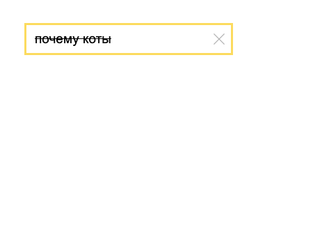
{:.next}

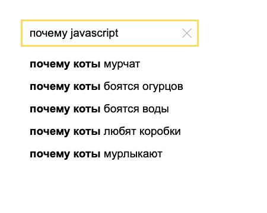
{:.next}

## Объяснение Race Condition
{:.images}

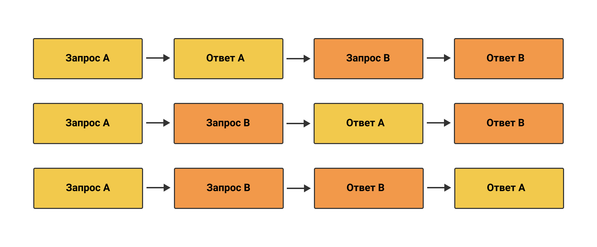

## Решение Race Condition

- ...При отправке запроса <b>прерываем</b> все предыдущие
- ...При обработке ответа <b>игнорируем</b> все предыдущие

```js
fromEvent(inputElem, 'keyup') // RxJS в действии
    .pipe(
        pluck('target', 'value'),
        switchMap(value => ajax.getJSON(`${URL}?search=${value}`))
    )
    .subscribe((response) => {
        // обновить DOM
    })
```
{:.next}

### ...[Reactive Extensions Library for JavaScript](https://rxjs.dev/)

## Итоги

- ...Event Loop
- ...Callback Hell
- ...Promise и корутины
- ...async/await
- ...Race Condition

## Рекомендации

<b>Книга</b>
- [Симпсон — {Вы не знаете JS} Асинхронная обработка и оптимизация](https://www.piter.com/product_by_id/141929485)

<b>Видео</b>
- [Джейк Арчибальд. В цикле - JSConf.Asia](https://youtu.be/cCOL7MC4Pl0)

<b>Статья</b>
- [Полное понимание асинхронности в браузере](https://habr.com/ru/companies/yandex/articles/718084/)


## Финальные титры
{:.fullscreen}

<figure markdown="1">
Финальные титры
</figure>
{:style="width: 600px;"}

## The End 👏
{:.section}

### Спасибо за внимание!


<!-- ## Контакты
{:.contacts}



<figure markdown="1">

### {{ site.author.name }}


{{ site.author.position }}


</figure>

 -->

<!-- 

<figure markdown="1">

### {{ site.author2.name }}


{{ site.author2.position }}


</figure>

 -->

<!-- разделитель контактов -->
<!-- ------- -->

<!-- left -->
<!-- - {:.skype}author -->
<!-- - {:.mail}author@yandex-team.ru -->
<!-- - {:.github}author -->

<!-- right -->
<!-- - {:.twitter}@author -->
<!-- - {:.facebook}author -->
<!-- - {:.telegram}@author -->

<!--

- {:.mail}author@yandex-team.ru
- {:.phone}+7-999-888-7766
- {:.github}author
- {:.bitbucket}author
- {:.twitter}@author
- {:.telegram}author
- {:.skype}author
- {:.instagram}author
- {:.facebook}author
- {:.vk}@author
- {:.ok}@author

-->
